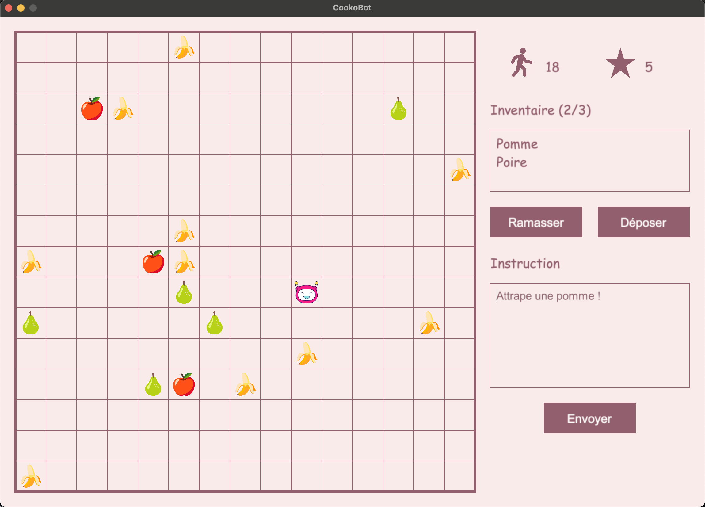

# CookoBot
### Développez des Agents LLM à travers un Mini Jeu Ludique

Ce projet offre une approche immersive pour apprendre comment interagir avec des modèles avancés de type LLM à travers un mini jeu vidéo interactif.



## Fonctionnalités de CookoBot

### Le Jeu
CookoBot est un jeu dans lequel vous contrôlez un robot capable de :
- **Se déplacer** sur une grille 15x15.
- **Ramasser des objets** placés sur certaines cases.
- **Déposer des objets** de son inventaire limité à trois éléments.

### L'Agent LLM
Le cœur de CookoBot repose sur la l'utilisation d'un modèle de langage naturel (LLM) pour interpréter les instructions de l'utilisateur et de les traduire en des commandes réalisables pour le robot :
- **MOVE X,Y** : déplace le robot vers les coordonnées spécifiées.
- **PICK** : ramasse un objet sur la case actuelle.
- **DROP** : dépose un objet sur la case actuelle.

Votre tâche consiste à élaborer des prompts précis et efficaces, permettant à l'agent LLM d'interpréter les intentions de l'utilisateur, de raisonner et de choisir la commande la plus appropriée.

### Les Composants Techniques
- **game.py** : Contient la logique du jeu, l'interface graphique (Arcade) et l'implémentation des actions possibles (ramassage, dépôt, déplacement).
- **llm_request.py** : Gère la communication avec l'API LLM, la construction de prompts et l'extraction des réponses.
- **requirements.txt** : Liste les dépendances nécessaires pour exécuter le projet.

## Comment commencer ?

1. **Installation** : Clonez ce dépôt :
   ```bash
   git clone https://github.com/Naowak/CookoBot
   ```

2. **Créer votre environnement virtuel** : Créez un environnement virtuel avec :
   ```bash
   python -m venv cooko_venv
   ```

3. **Activer l'environnement virtuel** : Activez l'environnement virtuel avec :
   ```bash
   source cooko_venv/bin/activate
   ```

4. **Installer les dépoendances** : Installez les dépendances nécessaires avec :
   ```bash
   pip install -r requirements.txt
   ```

5. **Get an API KEY**: Créer un compte OpenRouter et obtenir une clé API : https://openrouter.ai/

6. **Configuration** : Créez un fichier `.env` et ajoutez votre clé API comme suit :
   ```env
   API_KEY=your_openrouter_api_key
   ```

7. **Exécution** : Lancez le jeu en exécutant :
   ```bash
   python game.py
   ```

## Exemple d'Interaction
Après avoir lancé le jeu, vous pouvez saisir des instructions comme :
- *« Ramasse une poire »*
- *« Va chercher la pomme à droite »*

L'agent LLM analysera ces instructions, réfléchira sur la meilleure stratégie à suivre, et les traduira en commandes telles que `MOVE X,Y`, `PICK`, ou `DROP`.

## Défi pour les étudiants

Votre mission est de :
- Optimiser les prompts pour que l'agent LLM comprenne mieux les instructions et prenne des décisions plus judicieuses.
- Expérimenter avec différents types d'instructions et évaluer comment le modèle raisonne et répond.
- Modifier et améliorer le code pour ajouter de nouvelles fonctionnalités ou pour rendre le jeu plus interactif.

